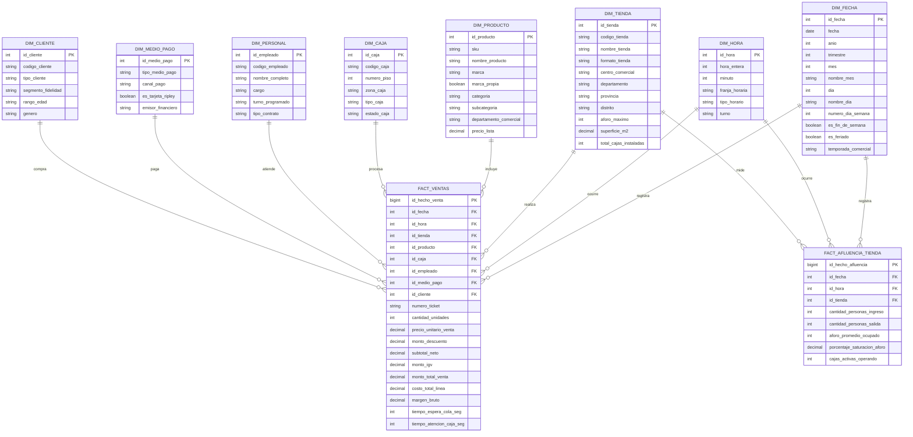

# ANÁLISIS Y MODELADO DIMENSIONAL

**Proyecto:** *Modelo de Inteligencia de Negocios para el análisis y optimización de la gestión de ventas y afluencia en horas pico de la empresa comercial Ripley*

---

## 1. Introducción y Contexto del Negocio

La empresa comercial **Ripley** experimenta variaciones críticas en la afluencia de clientes a lo largo de la jornada comercial. Durante las **horas pico** (alta demanda), se generan cuellos de botella en las baterías de cajas, elevando los tiempos de espera y provocando el abandono de carritos de compra. 

Para resolver esta problemática operativa mediante Inteligencia de Negocios, se requiere un modelo dimensional capaz de:
1. **Analizar la relación entre el flujo de visitantes y las ventas efectivas** por franja horaria.
2. **Detectar cuellos de botella en cajas** para redistribuir oportunamente al personal y habilitar cajas adicionales.
3. **Evaluar la rotación de categorías** en horas pico vs. horas valle para asegurar el reabastecimiento continuo en piso de venta.
4. **Alimentar el Dashboard analítico** con Heatmaps de ventas por horario, ratios de conversión (afluencia vs. tickets cobrados), tiempos de atención y ticket promedio.

---

## 2. Metodología de Diseño Dimensional (Ciclo de 4 Pasos de Ralph Kimball)

El diseño del modelo se estructura estrictamente bajo la **metodología de los cuatro pasos de Ralph Kimball**:

```
┌─────────────────────────┐     ┌─────────────────────────┐     ┌─────────────────────────┐     ┌─────────────────────────┐
│         PASO 1          │     │         PASO 2          │     │         PASO 3          │     │         PASO 4          │
│  Seleccionar el Proceso │ ──> │ Declarar la Granularidad│ ──> │ Identificar Dimensiones │ ──> │ Identificar los Hechos  │
│        de Negocio       │     │     (Nivel de Detalle)  │     │      y sus Atributos    │     │       y Métricas        │
└─────────────────────────┘     └─────────────────────────┘     └─────────────────────────┘     └─────────────────────────┘
```

1. **Paso 1:** Seleccionar el proceso de negocio a modelar.
2. **Paso 2:** Declarar formalmente la granularidad de las tablas de hechos.
3. **Paso 3:** Identificar las dimensiones del contexto y definir sus atributos y jerarquías.
4. **Paso 4:** Identificar los hechos y métricas cuantitativas que miden el rendimiento.
5. **Cierre:** Diagramación del modelo dimensional (Esquema Constelación / Estrella).

---

## 3. Paso 1: Selección de los Procesos de Negocio

Un proceso de negocio representa una actividad operativa fundamental que genera eventos medibles. Para responder a los objetivos de Ripley, se seleccionan **dos procesos de negocio complementarios**:

### Proceso 1: Venta y Facturación en Puntos de Venta (POS)
* **Descripción:** Registro de cada transacción comercial efectuada en las cajas físicas y módulos de autoatención (Self-Checkout) de las tiendas Ripley.
* **Objetivo Analítico:** Medir los ingresos monetarios, unidades comercializadas, márgenes de ganancia, tickets promedio y tiempos de atención/espera en cola.
* **Fuente Operativa:** Sistema transaccional de cajas (POS / ERP Comercial).

### Proceso 2: Monitoreo de Afluencia y Aforo en Tienda
* **Descripción:** Registro continuo del flujo peatonal de clientes que entran y salen de la tienda, así como el nivel de saturación del aforo.
* **Objetivo Analítico:** Cuantificar el tráfico de personas por hora para contrastarlo contra las ventas efectivas y detectar tasas de abandono en horas pico.
* **Fuente Operativa:** Sensores infrarrojos y cámaras inteligentes de conteo de personas en los accesos de la tienda.

---

## 4. Paso 2: Declaración de la Granularidad

La granularidad define el nivel de detalle de cada registro en la tabla de hechos. Kimball enfatiza: *"Declare siempre el grano antes de elegir dimensiones y hechos, y prefiera el grano más atómico posible para maximizar la flexibilidad analítica"*.

### Granularidad de `FACT_VENTAS` (Grano Atómico / Transaccional)
* **Declaración Formal:**
  > *"Cada fila en la tabla `FACT_VENTAS` representa **la venta de un ítem/producto individual** dentro de una transacción/ticket emitida en una caja específica de una tienda Ripley, en un minuto y fecha determinados, procesada por un colaborador y abonada mediante un medio de pago."*
* **Justificación:**  
  Permite desglosar y agregar la información a cualquier nivel: analizar la rotación de categorías específicas en horas pico, calcular el ticket promedio y evaluar los tiempos de espera y atención sin perder detalle.

### Granularidad de `FACT_AFLUENCIA_TIENDA` (Grano de Instantánea Periódica)
* **Declaración Formal:**
  > *"Cada fila en la tabla `FACT_AFLUENCIA_TIENDA` representa el **resumen acumulado de personas ingresadas, personas salidas, nivel promedio de aforo y número de cajas activas** en una tienda Ripley durante **un intervalo de 1 hora** en una fecha determinada."*
* **Justificación:**  
  Los sensores de aforo miden flujo de visitantes acumulado. Esta granularidad horaria coincide con las franjas horarias de ventas, permitiendo cruzar ambos datos de forma limpia.

### Justificación Metodológica: ¿Por qué dos tablas de hechos?
1. **Incompatibilidad de grano:** Unir el tráfico de la tienda (por hora) con la venta de un producto (por segundo) en una sola tabla violaría la regla del grano homogéneo de Kimball y causaría **doble conteo / inflación de datos** (`Double Counting`).
2. **Naturaleza del hecho:** `FACT_VENTAS` es una tabla de hechos transaccional (evento puntual), mientras que `FACT_AFLUENCIA_TIENDA` es una instantánea periódica (*Periodic Snapshot*).

---

## 5. Paso 3: Identificación y Definición de las Dimensiones

Las dimensiones proporcionan el contexto (*¿quién?, ¿cuándo?, ¿dónde?, ¿qué se vendió?, ¿cómo se pagó?*) para filtrar, agrupar y segmentar los hechos.

> **Nota Metodológica sobre Claves Sustitutas (Surrogate Keys - PK):**  
> Todas las dimensiones utilizan una **clave sustituta entera autoincremental (`INT`)**, generada internamente por el Data Warehouse. Esto independiza el modelo analítico de las claves naturales del ERP/POS, optimiza el rendimiento de los *JOINs* en tablas de millones de registros y facilita la gestión de cambios históricos (SCD - Slowly Changing Dimensions).

A continuación se detalla cada dimensión con sus atributos, tipos de datos y jerarquías:

### 1. Dimensión Tiempo / Fecha (`DIM_FECHA`)
Permite analizar la evolución temporal diaria, semanal, mensual y estacional.
* **Jerarquía:** Año → Trimestre → Mes → Semana → Día Calendario

| Atributo | Tipo de Dato | Clave | Descripción / Ejemplo |
| :--- | :--- | :---: | :--- |
| `id_fecha` | INT | **PK** | Clave sustituta formato entero (ej. `20260826`) |
| `fecha` | DATE | | Fecha calendario (`2026-08-26`) |
| `anio` | SMALLINT | | Año (`2026`) |
| `trimestre` | TINYINT | | Número de trimestre (1 a 4) |
| `mes` | TINYINT | | Número del mes (1 a 12) |
| `nombre_mes` | VARCHAR(15) | | *Enero*, *Agosto*, *Diciembre* |
| `dia` | TINYINT | | Día del mes (1 a 31) |
| `nombre_dia` | VARCHAR(15) | | Día de la semana (*Lunes*, *Sábado*) |
| `numero_dia_semana` | TINYINT | | 1 (Lunes) a 7 (Domingo) |
| `es_fin_de_semana` | BOOLEAN | | `TRUE` para sábado y domingo |
| `es_feriado` | BOOLEAN | | Indicador de feriado oficial |
| `temporada_comercial`| VARCHAR(30) | | *CyberDays*, *Navidad*, *Día de la Madre*, *Regular* |

---

### 2. Dimensión Franja Horaria (`DIM_HORA`)
Permite identificar las fluctuaciones intradía y aislar los horarios críticos.
* **Jerarquía:** Turno → Tipo de Horario → Franja Horaria → Hora → Minuto

| Atributo | Tipo de Dato | Clave | Descripción / Ejemplo |
| :--- | :--- | :---: | :--- |
| `id_hora` | INT | **PK** | Clave sustituta horaria (ej. `1830` = 18:30) |
| `hora_entera` | TINYINT | | Hora en formato 24h (0 a 23) |
| `minuto` | TINYINT | | Minuto del evento (0 a 59) |
| `franja_horaria` | VARCHAR(20) | | Bloque horario analítico (`18:00 - 19:00`, `19:00 - 20:00`) |
| `tipo_horario` | VARCHAR(20) | | Clasificación: **Hora Pico**, **Hora Valle**, **Hora Normal** |
| `turno` | VARCHAR(15) | | *Mañana* (10:00-14:00), *Tarde* (14:00-18:00), *Noche* (18:00-22:00) |

---

### 3. Dimensión Tienda / Sucursal (`DIM_TIENDA`)
Modela la localización geográfica e infraestructura de los locales comerciales.
* **Jerarquía:** Departamento → Provincia → Distrito → Tienda / Sucursal

| Atributo | Tipo de Dato | Clave | Descripción / Ejemplo |
| :--- | :--- | :---: | :--- |
| `id_tienda` | INT | **PK** | Clave sustituta de la sucursal |
| `codigo_tienda` | VARCHAR(10) | | Clave natural ERP (ej. `RIP-JOK`, `RIP-SMI`) |
| `nombre_tienda` | VARCHAR(100) | | *Ripley Jockey Plaza*, *Ripley San Miguel* |
| `formato_tienda` | VARCHAR(50) | | *Tienda por Departamentos*, *Express*, *Maxi* |
| `centro_comercial`| VARCHAR(100) | | Mall donde opera o tienda puerta a calle |
| `departamento` | VARCHAR(50) | | *Lima*, *Arequipa*, *La Libertad* |
| `provincia` | VARCHAR(50) | | *Lima*, *Arequipa*, *Trujillo* |
| `distrito` | VARCHAR(50) | | *Surco*, *San Miguel*, *Cayma* |
| `aforo_maximo` | INT | | Capacidad máxima legal de personas |
| `superficie_m2` | DECIMAL(10,2)| | Área comercial total en m² |
| `total_cajas_instaladas` | INT | | Número total de puestos de cobro físicos |

---

### 4. Dimensión Producto / Catálogo (`DIM_PRODUCTO`)
Estructura los artículos comercializados y permite evaluar rotaciones por horario.
* **Jerarquía:** División Comercial → Categoría → Subcategoría → SKU / Producto

| Atributo | Tipo de Dato | Clave | Descripción / Ejemplo |
| :--- | :--- | :---: | :--- |
| `id_producto` | INT | **PK** | Clave sustituta del producto |
| `sku` | VARCHAR(30) | | Código SKU de inventario / código de barras |
| `nombre_producto` | VARCHAR(150) | | Descripción del artículo |
| `marca` | VARCHAR(60) | | *Marquis*, *Index*, *Samsung*, *LG* |
| `marca_propia` | BOOLEAN | | `TRUE` si es marca de Ripley (*Marquis*, *Index*, *Barbados*) |
| `categoria` | VARCHAR(60) | | *Moda Mujer*, *Electrohogar*, *Tecnología*, *Calzado* |
| `subcategoria` | VARCHAR(60) | | *Smartphones*, *Casacas*, *Televisores*, *Perfumes* |
| `departamento_comercial`| VARCHAR(60) | | *Blandas* (Vestuario) / *Duras* (Electro/Deco) |
| `precio_lista` | DECIMAL(10,2)| | Precio regular de catálogo |

---

### 5. Dimensión Caja / Punto de Venta (`DIM_CAJA`)
Identifica el terminal físico o automatizado donde se realiza el cobro.
* **Jerarquía:** Tienda → Piso/Nivel → Zona de Cajas → Terminal de Caja

| Atributo | Tipo de Dato | Clave | Descripción / Ejemplo |
| :--- | :--- | :---: | :--- |
| `id_caja` | INT | **PK** | Clave sustituta del terminal |
| `codigo_caja` | VARCHAR(20) | | Código de terminal POS (ej. `POS-P1-04`) |
| `numero_piso` | TINYINT | | Nivel/Piso en tienda (1, 2, 3, etc.) |
| `zona_caja` | VARCHAR(50) | | *Cajas Centrales*, *Caja Electro*, *Caja Perfumería* |
| `tipo_caja` | VARCHAR(30) | | *Tradicional Asistida*, *Self-Checkout (Autoatención)* |
| `estado_caja` | VARCHAR(20) | | *Operativa*, *En Mantenimiento*, *Inactiva* |

---

### 6. Dimensión Personal / Cajero (`DIM_PERSONAL`)
Permite evaluar el rendimiento por cajero y planificar turnos y refuerzos.

| Atributo | Tipo de Dato | Clave | Descripción / Ejemplo |
| :--- | :--- | :---: | :--- |
| `id_empleado` | INT | **PK** | Clave sustituta del colaborador |
| `codigo_empleado` | VARCHAR(20) | | Código de planilla (ej. `EMP-88231`) |
| `nombre_completo` | VARCHAR(120) | | Nombres y apellidos |
| `cargo` | VARCHAR(50) | | *Cajero Principal*, *Cajero Volante*, *Supervisor* |
| `turno_programado` | VARCHAR(30) | | *Mañana*, *Tarde*, *Refuerzo Hora Pico* |
| `tipo_contrato` | VARCHAR(30) | | *Full-Time*, *Part-Time* |

---

### 7. Dimensión Medio de Pago (`DIM_MEDIO_PAGO`)
Evalúa los métodos de cobro y su influencia en la velocidad de atención.

| Atributo | Tipo de Dato | Clave | Descripción / Ejemplo |
| :--- | :--- | :---: | :--- |
| `id_medio_pago` | INT | **PK** | Clave sustituta del medio de pago |
| `tipo_medio_pago` | VARCHAR(50) | | *Tarjeta Ripley*, *Débito*, *Crédito Externo*, *Efectivo*, *Yape/Plin* |
| `canal_pago` | VARCHAR(30) | | *POS Físico*, *Contactless*, *QR*, *Efectivo* |
| `es_tarjeta_ripley`| BOOLEAN | | `TRUE` si utiliza crédito Banco Ripley |
| `emisor_financiero`| VARCHAR(50) | | *Banco Ripley*, *Visa*, *Mastercard*, *BCP* |

---

### 8. Dimensión Cliente (`DIM_CLIENTE`)
Permite segmentar las transacciones según fidelidad y perfil del comprador.

| Atributo | Tipo de Dato | Clave | Descripción / Ejemplo |
| :--- | :--- | :---: | :--- |
| `id_cliente` | INT | **PK** | Clave sustituta del cliente |
| `codigo_cliente` | VARCHAR(30) | | Hash del DNI / Código Ripley Puntos Go |
| `tipo_cliente` | VARCHAR(30) | | *Cliente Tarjeta Ripley*, *Socio Puntos*, *Ocasional* |
| `segmento_fidelidad`| VARCHAR(30) | | *Silver*, *Gold*, *Black*, *Sin Fidelizar* |
| `rango_edad` | VARCHAR(20) | | *18-25*, *26-35*, *36-50*, *50+* |
| `genero` | VARCHAR(15) | | *Femenino*, *Masculino*, *No Especificado* |

---

## 6. Paso 4: Identificación de Hechos y Métricas

Los hechos son las mediciones numéricas cuantitativas resultantes del evento del negocio. Se clasifican según su aditividad (aditivos, semiaditivos o no aditivos).

### Tabla de Hechos 1: `FACT_VENTAS` (Transaccional)
Almacena el detalle de las transacciones comerciales y el desempeño del servicio en caja:

| Columna / Medida | Tipo de Dato | Rol Dimensional | Tipo de Métrica | Descripción / Utilidad |
| :--- | :--- | :---: | :---: | :--- |
| `id_hecho_venta` | BIGINT | **PK** | - | Identificador único de fila |
| `id_fecha` | INT | **FK** | - | Conexión con `DIM_FECHA` |
| `id_hora` | INT | **FK** | - | Conexión con `DIM_HORA` |
| `id_tienda` | INT | **FK** | - | Conexión con `DIM_TIENDA` |
| `id_producto` | INT | **FK** | - | Conexión con `DIM_PRODUCTO` |
| `id_caja` | INT | **FK** | - | Conexión con `DIM_CAJA` |
| `id_empleado` | INT | **FK** | - | Conexión con `DIM_PERSONAL` |
| `id_medio_pago` | INT | **FK** | - | Conexión con `DIM_MEDIO_PAGO` |
| `id_cliente` | INT | **FK** | - | Conexión con `DIM_CLIENTE` |
| `numero_ticket` | VARCHAR(30) | **Degenerada** | - | Código de boleta/factura (permite agrupar transacciones) |
| `cantidad_unidades` | INT | **Métrica** | Aditiva | Unidades de producto vendidas |
| `precio_unitario_venta` | DECIMAL(10,2) | **Métrica** | No aditiva | Precio cobrado por unidad |
| `monto_descuento` | DECIMAL(10,2) | **Métrica** | Aditiva | Rebaja aplicada a la línea |
| `subtotal_neto` | DECIMAL(10,2) | **Métrica** | Aditiva | Base imponible |
| `monto_igv` | DECIMAL(10,2) | **Métrica** | Aditiva | Impuesto IGV (18%) |
| `monto_total_venta` | DECIMAL(10,2) | **Métrica** | Aditiva | Total facturado de la línea |
| `costo_total_linea` | DECIMAL(10,2) | **Métrica** | Aditiva | Costo de adquisición de las unidades |
| `margen_bruto` | DECIMAL(10,2) | **Métrica** | Aditiva | `monto_total_venta - costo_total_linea` |
| `tiempo_espera_cola_seg` | INT | **Métrica** | Semiaditiva | Tiempo en segundos de espera del cliente antes de ser atendido |
| `tiempo_atencion_caja_seg`| INT | **Métrica** | Semiaditiva | Tiempo en segundos de escaneo y pago en caja |

---

### Tabla de Hechos 2: `FACT_AFLUENCIA_TIENDA` (Instantánea Periódica)
Almacena el flujo de visitantes y estado de la capacidad de la tienda:

| Columna / Medida | Tipo de Dato | Rol Dimensional | Tipo de Métrica | Descripción / Utilidad |
| :--- | :--- | :---: | :---: | :--- |
| `id_hecho_afluencia` | BIGINT | **PK** | - | Identificador único de fila |
| `id_fecha` | INT | **FK** | - | Conexión con `DIM_FECHA` |
| `id_hora` | INT | **FK** | - | Conexión con `DIM_HORA` |
| `id_tienda` | INT | **FK** | - | Conexión con `DIM_TIENDA` |
| `cantidad_personas_ingreso` | INT | **Métrica** | Aditiva | Total de personas ingresadas por sensores en la hora |
| `cantidad_personas_salida` | INT | **Métrica** | Aditiva | Total de personas que salieron en la hora |
| `aforo_promedio_ocupado` | INT | **Métrica** | Semiaditiva | Promedio de personas dentro del local simultáneamente |
| `porcentaje_saturacion_aforo`| DECIMAL(5,2) | **Métrica** | No aditiva | `(aforo_promedio_ocupado / aforo_maximo) * 100` |
| `cajas_activas_operando` | INT | **Métrica** | Semiaditiva | Cantidad de cajas operativas abiertas en la franja |

---

### Mapeo de Hechos hacia los Requerimientos del Dashboard
El diseño de hechos responde de forma directa a cada componente solicitado en `PROYECT.md`:

| Componente del Dashboard | Indicador / KPI | Tablas Involucradas | Expresión / Cálculo Conceptual |
| :--- | :--- | :--- | :--- |
| **Heatmap de Ventas** | Ingresos por día y hora | `FACT_VENTAS`, `DIM_FECHA`, `DIM_HORA` | `SUM(monto_total_venta)` agrupado por `nombre_dia` y `hora_entera`. |
| **Gráfico de Líneas Cruzado** | Afluencia vs. Transacciones | `FACT_AFLUENCIA_TIENDA`, `FACT_VENTAS`, `DIM_HORA` | Eje X: `franja_horaria`.<br>Línea 1: `SUM(cantidad_personas_ingreso)`.<br>Línea 2: `COUNT(DISTINCT numero_ticket)`. |
| **KPI: Ticket Promedio** | Ticket promedio en Pico vs. Valle | `FACT_VENTAS`, `DIM_HORA` | `SUM(monto_total_venta) / COUNT(DISTINCT numero_ticket)` filtrado por `tipo_horario = 'Hora Pico'` vs. `'Hora Valle'`. |
| **KPI: Tiempos de Atención** | Espera en colas y tiempo de caja | `FACT_VENTAS`, `DIM_HORA`, `DIM_CAJA` | `AVG(tiempo_espera_cola_seg)` y `AVG(tiempo_atencion_caja_seg)`. |
| **Ranking / Treemap** | Categorías de mayor rotación | `FACT_VENTAS`, `DIM_PRODUCTO`, `DIM_HORA` | `SUM(cantidad_unidades)` ordenado desc por `categoria` en franjas pico. |
| **Tasa de Conversión (KPI)** | % de visitantes que compran | `FACT_VENTAS`, `FACT_AFLUENCIA_TIENDA` | `(COUNT(DISTINCT numero_ticket) / SUM(cantidad_personas_ingreso)) * 100`. |

---

## 7. Diagramación del Análisis Dimensional

Como culminación de la metodología, se presenta la diagramación del modelo dimensional en arquitectura de **Constelación de Hechos (Fact Constellation)** con dimensiones conformadas. 

Todas las relaciones entre las dimensiones y las tablas de hechos son de **uno a muchos ($1:N$)**, garantizando integridad referencial mediante claves foráneas.

### Diagrama Entidad-Relación Dimensional (ERD)


