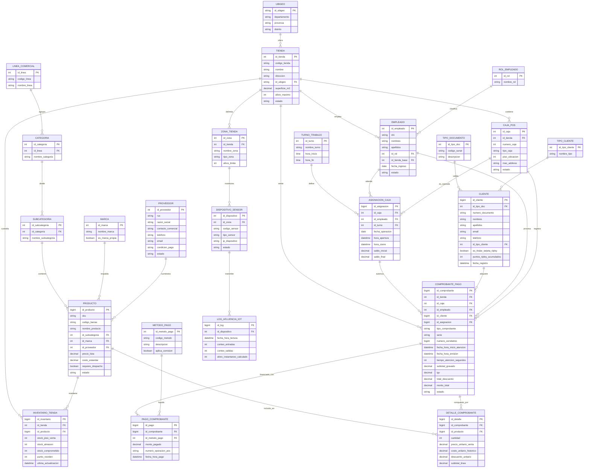

# MODELO RELACIONAL TRANSACCIONAL (OLTP) - SISTEMA FUENTE RIPLEY

**Proyecto:** *Modelo de Inteligencia de Negocios para el análisis y optimización de la gestión de ventas y afluencia en horas pico de la empresa comercial Ripley*  
**Tipo de Modelo:** Relacional Operativo / Transaccional (3NF - Tercera Forma Normal)  
**Rol Arquitectónico:** Base de datos fuente operacional (OLTP / ODS) que da origen y alimenta el proceso ETL hacia el Data Mart Dimensional.

---

## 1. Fundamentos Arquitectónicos: Transaccional (OLTP) vs. Analítico (Data Mart)

> [!IMPORTANT]
> **Precisión Conceptual y Terminológica:**  
> En la literatura estándar de Arquitectura de Datos (Ralph Kimball, Bill Inmon), un **Data Mart** es por definición una estructura **dimensional** (tablas de hechos y dimensiones organizadas en esquemas estrella o copo de nieve) diseñada para responder consultas analíticas de un área o proceso de negocio.  
> 
> Lo que en el ámbito académico de este curso se solicita como *"el diseño de base de datos previo con el desarrollo natural de las entidades, sin hechos ni dimensiones"* corresponde técnicamente a la **Base de Datos Transaccional (OLTP - Online Transaction Processing)** o a un **Almacén Operativo de Datos (ODS)**. 
> 
> Este documento materializa dicho diseño operativo en **Tercera Forma Normal (3NF)**, conteniendo las entidades completas del día a día del negocio (inventarios, proveedores, turnos, comprobantes, sensores) a partir de las cuales se extraen y desnormalizan los datos para construir el Data Mart Dimensional documentado en `ANALISIS_DIMENSIONAL.md`.

### Comparativa de Objetivos de Diseño

| Criterio | Base de Datos Transaccional (Este Documento) | Data Mart Dimensional (`ANALISIS_DIMENSIONAL.md`) |
| :--- | :--- | :--- |
| **Paradigma** | Relacional normalizado (3NF) | Dimensional (Estrella / Constelación) |
| **Propósito** | Soportar las operaciones atómicas diarias (CRUD rápido, integridad referencial). | Facilitar consultas analíticas complejas, agregaciones y reportería gerencial. |
| **Estructuras** | Tablas operativas, catálogos jerarquizados, tablas de auditoría e inventario. | Tablas de Hechos (`FACT`) rodeadas de Dimensiones (`DIM`). |
| **Redundancia** | Nula o mínima (evitar anomalías de inserción, actualización y borrado). | Controlada y deliberada (desnormalización de jerarquías para acelerar `JOIN`). |
| **Claves** | Claves primarias de negocio / autoincrementales (`id_tienda`, `sku`, etc.). | Claves sustitutas numéricas artificiales (`sk_tiempo`, `sk_producto`, etc.). |

---

## 2. Desarrollo Natural de Entidades del Negocio (3NF)

El sistema transaccional de Ripley contempla cinco dominios funcionales operativos:

```
┌────────────────────────────────────────────────────────────────────────────────────────┐
│                               DOMINIOS OPERATIVOS (OLTP)                               │
├────────────────────┬────────────────────┬────────────────────┬─────────────────────────┤
│ 1. Estructura y    │ 2. Catálogo e      │ 3. Clientes y      │ 4. Ventas y             │
│    Personal        │    Inventario      │    Fidelización    │    Facturación          │
│ • UBIGEO           │ • LINEA_COMERCIAL  │ • TIPO_DOCUMENTO   │ • METODO_PAGO           │
│ • TIENDA           │ • CATEGORIA        │ • TIPO_CLIENTE     │ • COMPROBANTE_PAGO      │
│ • CAJA_POS         │ • SUBCATEGORIA     │ • CLIENTE          │ • DETALLE_COMPROBANTE   │
│ • TURNO_TRABAJO    │ • MARCA            │                    │ • PAGO_COMPROBANTE      │
│ • ROL_EMPLEADO     │ • PROVEEDOR        │                    │                         │
│ • EMPLEADO         │ • PRODUCTO         │                    │ 5. Tráfico y Sensores   │
│ • ASIGNACION_CAJA  │ • INVENTARIO_TIENDA│                    │ • ZONA_TIENDA           │
│                    │                    │                    │ • DISPOSITIVO_SENSOR    │
│                    │                    │                    │ • LOG_AFLUENCIA_IOT     │
└────────────────────┴────────────────────┴────────────────────┴─────────────────────────┘
```

---

## 3. Diccionario de Datos del Modelo Relacional

### 3.1 Módulo Estructura Organizacional, Tiendas y Puntos de Venta (POS)

#### Tabla: `UBIGEO`
Almacena la división geográfica estandarizada a nivel nacional.
* `id_ubigeo` (VARCHAR(6), PK): Código oficial de ubigeo (INEI).
* `departamento` (VARCHAR(50), NOT NULL): Departamento (ej. Lima, Arequipa).
* `provincia` (VARCHAR(50), NOT NULL): Provincia.
* `distrito` (VARCHAR(50), NOT NULL): Distrito.

#### Tabla: `TIENDA`
Registro físico de los centros comerciales o sedes Ripley.
* `id_tienda` (INT, PK AUTO_INCREMENT): Identificador único de la tienda.
* `codigo_tienda` (VARCHAR(10), UNIQUE, NOT NULL): Código operativo (ej. 'RIP-SJI').
* `nombre` (VARCHAR(100), NOT NULL): Nombre de la sede (ej. 'Ripley Jockey Plaza').
* `direccion` (VARCHAR(200), NOT NULL): Dirección física.
* `id_ubigeo` (VARCHAR(6), FK -> UBIGEO.id_ubigeo): Ubicación geográfica.
* `superficie_m2` (DECIMAL(10,2), NOT NULL): Área de sala de venta.
* `aforo_maximo` (INT, NOT NULL): Capacidad máxima autorizada de personas.
* `estado` (VARCHAR(20), NOT NULL): Estado operativo ('Activa', 'Remodelacion', 'Inactiva').

#### Tabla: `CAJA_POS`
Terminales físicas y estaciones de autoservicio instaladas por tienda.
* `id_caja` (INT, PK AUTO_INCREMENT): Identificador del terminal.
* `id_tienda` (INT, FK -> TIENDA.id_tienda): Tienda a la que pertenece la caja.
* `numero_caja` (INT, NOT NULL): Número correlativo dentro de la tienda (ej. Caja 12).
* `tipo_caja` (VARCHAR(30), NOT NULL): 'Caja Tradicional', 'Self-Checkout', 'Caja Rapida'.
* `piso_ubicacion` (INT, NOT NULL): Nivel dentro de la tienda (Nivel 1, Nivel 2).
* `mac_address` (VARCHAR(20), UNIQUE): Dirección de red del hardware de caja.
* `estado` (VARCHAR(20), NOT NULL): 'Operativa', 'En Mantenimiento', 'Fuera de Servicio'.

#### Tabla: `TURNO_TRABAJO`
Horarios definidos para la gestión de la dotación de personal.
* `id_turno` (INT, PK AUTO_INCREMENT): Identificador del turno.
* `nombre_turno` (VARCHAR(50), NOT NULL): 'Mañana Apertura', 'Tarde Pico', 'Noche Cierre'.
* `hora_inicio` (TIME, NOT NULL): Hora contractual de inicio.
* `hora_fin` (TIME, NOT NULL): Hora contractual de fin.

#### Tabla: `ROL_EMPLEADO`
Roles y perfiles de responsabilidad.
* `id_rol` (INT, PK AUTO_INCREMENT): Identificador del rol.
* `nombre_rol` (VARCHAR(50), NOT NULL): 'Cajero', 'Supervisor de Cajas', 'Jefe de Tienda', 'Asesor de Ventas'.

#### Tabla: `EMPLEADO`
Colaboradores contratados por la empresa.
* `id_empleado` (INT, PK AUTO_INCREMENT): Identificador del trabajador.
* `dni` (VARCHAR(15), UNIQUE, NOT NULL): Documento de identidad.
* `nombres` (VARCHAR(100), NOT NULL): Nombres del colaborador.
* `apellidos` (VARCHAR(100), NOT NULL): Apellidos del colaborador.
* `id_rol` (INT, FK -> ROL_EMPLEADO.id_rol): Rol asignado.
* `id_tienda_base` (INT, FK -> TIENDA.id_tienda): Tienda en la que labora habitualmente.
* `fecha_ingreso` (DATE, NOT NULL): Fecha de contratación.
* `estado` (VARCHAR(20), NOT NULL): 'Activo', 'Vacaciones', 'Cesado'.

#### Tabla: `ASIGNACION_CAJA`
Control operativo de apertura, asignación y cuadre de cajas.
* `id_asignacion` (BIGINT, PK AUTO_INCREMENT): Identificador de la sesión de caja.
* `id_caja` (INT, FK -> CAJA_POS.id_caja): Caja operada.
* `id_empleado` (INT, FK -> EMPLEADO.id_empleado): Cajero responsable.
* `id_turno` (INT, FK -> TURNO_TRABAJO.id_turno): Turno laborado.
* `fecha_operacion` (DATE, NOT NULL): Día calendario de la sesión.
* `hora_apertura` (DATETIME, NOT NULL): Marca de tiempo de apertura de sesión.
* `hora_cierre` (DATETIME, NULL): Marca de tiempo de cierre y arqueo.
* `saldo_inicial` (DECIMAL(10,2), NOT NULL): Fondo de caja inicial (sencillo).
* `saldo_final` (DECIMAL(10,2), NULL): Monto total recaudado al cierre.

---

### 3.2 Módulo Catálogo de Productos, Proveedores e Inventario

Para cumplir con la Tercera Forma Normal (3NF), la jerarquía de productos se modela desagregada en tablas normalizadas independientes:

#### Tabla: `PROVEEDOR`
Empresas que suministran mercadería a Ripley.
* `id_proveedor` (INT, PK AUTO_INCREMENT): Identificador del proveedor.
* `ruc` (VARCHAR(11), UNIQUE, NOT NULL): Registro Único de Contribuyentes.
* `razon_social` (VARCHAR(150), NOT NULL): Razón social.
* `contacto_comercial` (VARCHAR(100)): Nombre del ejecutivo de cuenta.
* `telefono` (VARCHAR(20)): Teléfono de contacto.
* `email` (VARCHAR(100)): Correo corporativo.
* `condicion_pago` (VARCHAR(50)): 'Contado', 'Credito 30 dias', 'Consignacion'.
* `estado` (VARCHAR(20), NOT NULL): 'Activo', 'Suspendido'.

#### Tabla: `LINEA_COMERCIAL`
Nivel macro de clasificación de productos.
* `id_linea` (INT, PK AUTO_INCREMENT): Identificador de la línea.
* `codigo_linea` (VARCHAR(10), UNIQUE, NOT NULL): Código (ej. 'LIN-MOD', 'LIN-ELE').
* `nombre_linea` (VARCHAR(100), NOT NULL): 'Moda y Calzado', 'Electro y Tecnologia', 'Decohogar', 'Belleza'.

#### Tabla: `CATEGORIA`
Familias de productos pertenecientes a una línea comercial.
* `id_categoria` (INT, PK AUTO_INCREMENT): Identificador de la categoría.
* `id_linea` (INT, FK -> LINEA_COMERCIAL.id_linea): Línea padre.
* `nombre_categoria` (VARCHAR(100), NOT NULL): 'Televisores', 'Ropa Mujer', 'Calzado Deportivo'.

#### Tabla: `SUBCATEGORIA`
Agrupaciones específicas de productos.
* `id_subcategoria` (INT, PK AUTO_INCREMENT): Identificador de la subcategoría.
* `id_categoria` (INT, FK -> CATEGORIA.id_categoria): Categoría padre.
* `nombre_subcategoria` (VARCHAR(100), NOT NULL): 'Smart TV OLED', 'Jeans Juveniles', 'Zapatillas Running'.

#### Tabla: `MARCA`
Fabricantes o licencias comerciales.
* `id_marca` (INT, PK AUTO_INCREMENT): Identificador de marca.
* `nombre_marca` (VARCHAR(100), NOT NULL): 'Samsung', 'Marquis', 'Nike', 'Barbados'.
* `es_marca_propia` (BOOLEAN, NOT NULL): Indicador de marca exclusiva Ripley (ej. Marquis = TRUE).

#### Tabla: `PRODUCTO`
Maestro de artículos comercializables (Stock Keeping Unit).
* `id_producto` (BIGINT, PK AUTO_INCREMENT): Identificador interno.
* `sku` (VARCHAR(30), UNIQUE, NOT NULL): Código SKU comercial de Ripley.
* `codigo_barras` (VARCHAR(50), UNIQUE): Código EAN/UPC escaneable en POS.
* `nombre_producto` (VARCHAR(200), NOT NULL): Nombre descriptivo.
* `id_subcategoria` (INT, FK -> SUBCATEGORIA.id_subcategoria): Clasificación fina.
* `id_marca` (INT, FK -> MARCA.id_marca): Marca del producto.
* `id_proveedor` (INT, FK -> PROVEEDOR.id_proveedor): Proveedor principal.
* `precio_lista` (DECIMAL(10,2), NOT NULL): Precio regular sugerido al público.
* `costo_estandar` (DECIMAL(10,2), NOT NULL): Costo promedio ponderado de adquisición.
* `requiere_despacho` (BOOLEAN, NOT NULL): Si es producto de retiro inmediato o despacho a domicilio.
* `estado` (VARCHAR(20), NOT NULL): 'Activo', 'Descontinuado', 'Agotado'.

#### Tabla: `INVENTARIO_TIENDA`
Control transaccional de existencias en tiempo real por tienda y almacén.
* `id_inventario` (BIGINT, PK AUTO_INCREMENT): Identificador de stock.
* `id_tienda` (INT, FK -> TIENDA.id_tienda): Tienda física.
* `id_producto` (BIGINT, FK -> PRODUCTO.id_producto): Producto almacenado.
* `stock_piso_venta` (INT, NOT NULL): Unidades disponibles directamente en exhibición.
* `stock_almacen` (INT, NOT NULL): Unidades en trastienda de la tienda.
* `stock_comprometido` (INT, NOT NULL): Unidades vendidas pendientes de entrega o retiro.
* `punto_reorden` (INT, NOT NULL): Nivel mínimo que dispara alerta de reposición.
* `ultima_actualizacion` (DATETIME, NOT NULL): Marca de tiempo del último movimiento.

---

### 3.3 Módulo Clientes y Fidelización

#### Tabla: `TIPO_DOCUMENTO`
Catálogo de documentos de identificación oficial.
* `id_tipo_doc` (INT, PK AUTO_INCREMENT): Identificador del tipo.
* `codigo_sunat` (VARCHAR(5), NOT NULL): Código oficial ('01' DNI, '04' Carnet Extranjería, '06' RUC, '07' Pasaporte).
* `descripcion` (VARCHAR(50), NOT NULL): Descripción completa.

#### Tabla: `TIPO_CLIENTE`
Segmentación comercial del cliente.
* `id_tipo_cliente` (INT, PK AUTO_INCREMENT): Identificador de segmento.
* `nombre_tipo` (VARCHAR(50), NOT NULL): 'Cliente Regular', 'Cliente Tarjeta Ripley', 'Colaborador Ripley', 'Cliente Corporativo'.

#### Tabla: `CLIENTE`
Padrón centralizado de compradores registrados.
* `id_cliente` (BIGINT, PK AUTO_INCREMENT): Identificador único del cliente.
* `id_tipo_doc` (INT, FK -> TIPO_DOCUMENTO.id_tipo_doc): Tipo de documento.
* `numero_documento` (VARCHAR(20), NOT NULL): Número de documento de identidad.
* `nombres` (VARCHAR(100), NOT NULL): Nombres o Razón Social.
* `apellidos` (VARCHAR(100), NULL): Apellidos (NULL en personas jurídicas).
* `email` (VARCHAR(150), NULL): Correo electrónico para comprobantes electrónicos.
* `telefono` (VARCHAR(20), NULL): Número móvil.
* `id_tipo_cliente` (INT, FK -> TIPO_CLIENTE.id_tipo_cliente): Segmentación de fidelización.
* `es_titular_tarjeta_ripley` (BOOLEAN, NOT NULL): Si posee tarjeta Ripley clásica o Silver/Black activa.
* `puntos_ripley_acumulados` (INT, DEFAULT 0): Saldo del programa de lealtad Ripley Puntos Go.
* `fecha_registro` (DATETIME, NOT NULL): Fecha de alta en el sistema.

---

### 3.4 Módulo Transaccional de Ventas y Facturación (POS)

El núcleo operativo de venta se divide en cabecera, detalle y pagos para cumplir con 3NF:

#### Tabla: `METODO_PAGO`
Formas de pago autorizadas en caja.
* `id_metodo_pago` (INT, PK AUTO_INCREMENT): Identificador del método.
* `codigo_metodo` (VARCHAR(20), UNIQUE, NOT NULL): 'TARJ_RIPLEY', 'TARJ_CREDITO', 'TARJ_DEBITO', 'EFECTIVO', 'BILLETERA_DIGITAL'.
* `descripcion` (VARCHAR(100), NOT NULL): Nombre descriptivo ('Tarjeta Ripley Crédito', 'Yape / Plin', 'Efectivo').
* `aplica_comision` (BOOLEAN, NOT NULL): Si genera costo financiero de adquirencia.

#### Tabla: `COMPROBANTE_PAGO`
Cabecera de cada transacción de venta emitida en terminal.
* `id_comprobante` (BIGINT, PK AUTO_INCREMENT): Identificador de la transacción.
* `id_tienda` (INT, FK -> TIENDA.id_tienda): Tienda donde ocurrió la compra.
* `id_caja` (INT, FK -> CAJA_POS.id_caja): Caja física emisora.
* `id_empleado` (INT, FK -> EMPLEADO.id_empleado): Cajero que procesó el cobro.
* `id_cliente` (BIGINT, FK -> CLIENTE.id_cliente): Cliente comprador (o ID por defecto 'Cliente Varios').
* `id_asignacion` (BIGINT, FK -> ASIGNACION_CAJA.id_asignacion): Sesión de caja activa.
* `tipo_comprobante` (VARCHAR(20), NOT NULL): 'Boleta de Venta', 'Factura', 'Nota de Credito'.
* `serie` (VARCHAR(5), NOT NULL): Serie electrónica (ej. 'B001', 'F001').
* `numero_correlativo` (BIGINT, NOT NULL): Correlativo fiscal correlativo SUNAT.
* `fecha_hora_inicio_atencion` (DATETIME, NOT NULL): Momento del primer escaneo de producto en caja.
* `fecha_hora_emision` (DATETIME, NOT NULL): Momento exacto del cierre de venta e impresión de ticket.
* `tiempo_atencion_segundos` (INT, NOT NULL): Duración total de la atención en caja.
* `subtotal_gravado` (DECIMAL(12,2), NOT NULL): Base imponible de la venta.
* `igv` (DECIMAL(12,2), NOT NULL): Impuesto General a las Ventas (18%).
* `total_descuento` (DECIMAL(12,2), NOT NULL): Rebajas por promociones o Tarjeta Ripley.
* `monto_total` (DECIMAL(12,2), NOT NULL): Importe final liquidado por el cliente.
* `estado` (VARCHAR(20), NOT NULL): 'Emitido', 'Anulado', 'Devuelto'.

#### Tabla: `DETALLE_COMPROBANTE`
Líneas de transacción individuales (productos comprados en el ticket).
* `id_detalle` (BIGINT, PK AUTO_INCREMENT): Identificador de la línea.
* `id_comprobante` (BIGINT, FK -> COMPROBANTE_PAGO.id_comprobante): Comprobante padre.
* `id_producto` (BIGINT, FK -> PRODUCTO.id_producto): Artículo adquirido.
* `cantidad` (INT, NOT NULL): Unidades compradas.
* `precio_unitario_venta` (DECIMAL(10,2), NOT NULL): Precio unitario cobrado al cliente.
* `costo_unitario_historico` (DECIMAL(10,2), NOT NULL): Costo contable del producto al momento de la venta.
* `descuento_unitario` (DECIMAL(10,2), DEFAULT 0): Descuento aplicado por unidad.
* `subtotal_linea` (DECIMAL(10,2), NOT NULL): (cantidad * precio_unitario_venta) - descuentos.

#### Tabla: `PAGO_COMPROBANTE`
Desglose de los medios de pago utilizados para cancelar un comprobante (soporta pagos mixtos).
* `id_pago` (BIGINT, PK AUTO_INCREMENT): Identificador del abono.
* `id_comprobante` (BIGINT, FK -> COMPROBANTE_PAGO.id_comprobante): Comprobante cancelado.
* `id_metodo_pago` (INT, FK -> METODO_PAGO.id_metodo_pago): Método de pago empleado.
* `monto_pagado` (DECIMAL(10,2), NOT NULL): Monto cubierto con este medio.
* `numero_operacion_pos` (VARCHAR(50), NULL): Código de autorización bancaria / voucher.
* `fecha_hora_pago` (DATETIME, NOT NULL): Momento de confirmación del pago.

---

### 3.5 Módulo de Monitoreo de Afluencia, Aforo y Sensores IoT

Para monitorear el flujo peatonal en horas pico vs. horas valle, el sistema operativo integra sensores inteligentes de conteo:

#### Tabla: `ZONA_TIENDA`
Subdivisiones físicas de control dentro de cada tienda.
* `id_zona` (INT, PK AUTO_INCREMENT): Identificador de la zona.
* `id_tienda` (INT, FK -> TIENDA.id_tienda): Tienda sede.
* `nombre_zona` (VARCHAR(100), NOT NULL): 'Acceso Principal Av. Javier Prado', 'Acceso Nivel 2 Estacionamiento', 'Piso 1 Moda Mujer'.
* `tipo_zona` (VARCHAR(30), NOT NULL): 'Acceso Exterior', 'Circulacion Interna', 'Bateria de Cajas'.
* `aforo_limite` (INT, NOT NULL): Capacidad de diseño permitida para esa zona.

#### Tabla: `DISPOSITIVO_SENSOR`
Hardware instalado para la telemetría de visitantes.
* `id_dispositivo` (INT, PK AUTO_INCREMENT): Identificador del sensor.
* `id_zona` (INT, FK -> ZONA_TIENDA.id_zona): Zona que vigila.
* `codigo_sensor` (VARCHAR(50), UNIQUE, NOT NULL): Código de inventario de TI (ej. 'IOT-CAM-3D-04').
* `tipo_sensor` (VARCHAR(50), NOT NULL): 'Camara 3D Conteo Estereoscopico', 'Sensor ToF Infrarrojo', 'Torniquete Bidireccional'.
* `ip_dispositivo` (VARCHAR(20), NOT NULL): Dirección IP de red interna.
* `estado` (VARCHAR(20), NOT NULL): 'Activo', 'Calibrando', 'Desconectado'.

#### Tabla: `LOG_AFLUENCIA_IOT`
Registros telemétricos en bruto generados por los sensores en intervalos regulares (ej. cada 5 minutos).
* `id_log` (BIGINT, PK AUTO_INCREMENT): Identificador del evento de telemetría.
* `id_dispositivo` (INT, FK -> DISPOSITIVO_SENSOR.id_dispositivo): Dispositivo emisor.
* `fecha_hora_lectura` (DATETIME, NOT NULL): Marca de tiempo del registro.
* `conteo_entradas` (INT, NOT NULL): Número de peatones que ingresaron en el intervalo.
* `conteo_salidas` (INT, NOT NULL): Número de peatones que egresaron en el intervalo.
* `aforo_instantaneo_calculado` (INT, NOT NULL): Ocupación de personas calculada al instante.

---

## 4. Diagrama Entidad-Relación Relacional (ERD - 3NF)

A continuación se muestra el diagrama formal relacional de todas las entidades operativas del sistema fuente Ripley:



---

## 5. Matriz de Mapeo: Transaccional (3NF) hacia Dimensional (Data Mart)

Esta matriz demuestra cómo este modelo operacional previo se transforma hacia el modelo analítico de `ANALISIS_DIMENSIONAL.md` a través del proceso ETL/ELT:

| Entidades Origen Transaccionales (3NF) | Tabla Destino Data Mart | Tipo de Transformación en ETL | Justificación Técnica |
| :--- | :--- | :--- | :--- |
| `PRODUCTO`, `MARCA`, `SUBCATEGORIA`, `CATEGORIA`, `LINEA_COMERCIAL` | `DIM_PRODUCTO` | **Desnormalización completa** (Aplanamiento de jerarquía en una sola dimensión). | Elimina 4 sentencias `JOIN` costosas en consultas analíticas de Power BI / SQL analítico. |
| `TIENDA`, `UBIGEO` | `DIM_TIENDA` | **Desnormalización geográfica** (Fusión de sede y ubigeo). | Facilita el análisis por región/distrito sin navegación relacional. |
| `CAJA_POS` | `DIM_CAJA` | **Enriquecimiento contextual** (Tipo de caja, piso y terminal). | Permite segmentar el rendimiento entre cajas tradicionales y *Self-Checkout*. |
| `EMPLEADO`, `ROL_EMPLEADO` | `DIM_PERSONAL` | **Fusión de perfil y datos personales**. | Evalúa la productividad y velocidad de atención por cajero. |
| `CLIENTE`, `TIPO_CLIENTE` | `DIM_CLIENTE` | **Filtrado y atributos de segmentación**. | Aislar el comportamiento de compra de clientes con Tarjeta Ripley. |
| `METODO_PAGO` | `DIM_MEDIO_PAGO` | **Copia directa dimensional**. | Cruzar la venta en hora pico contra el medio de cobro utilizado. |
| `COMPROBANTE_PAGO.fecha_hora_emision` | `DIM_FECHA` y `DIM_HORA` | **Descomposición de timestamp**. | Permite agrupar por franja horaria (`Es_Hora_Pico`), turno, día de semana y mes. |
| `COMPROBANTE_PAGO` (Cabecera) + `DETALLE_COMPROBANTE` (Líneas) | `FACT_VENTAS` | **Fusión a nivel de grano atómico**. | Cada fila de `DETALLE_COMPROBANTE` se une con las métricas de tiempo de su cabecera para medir ingresos, costos y segundos de espera. |
| `LOG_AFLUENCIA_IOT` + `DISPOSITIVO_SENSOR` + `ZONA_TIENDA` | `FACT_AFLUENCIA_TIENDA` | **Agregación periódica horaria**. | Los registros cada 5 minutos de sensores se consolidan por hora y tienda para habilitar el *Drill-Across* con las ventas de esa misma hora. |
| `INVENTARIO_TIENDA`, `PROVEEDOR`, `ASIGNACION_CAJA`, `PAGO_COMPROBANTE` | *(Descartadas del Data Mart actual)* | **Depuración de alcance**. | Son indispensables para el día a día operativo (reponer stock, pagar a proveedores, cuadrar caja chica), pero no aportan a los KPIs analíticos de saturación en horas pico del Dashboard esperado. |
